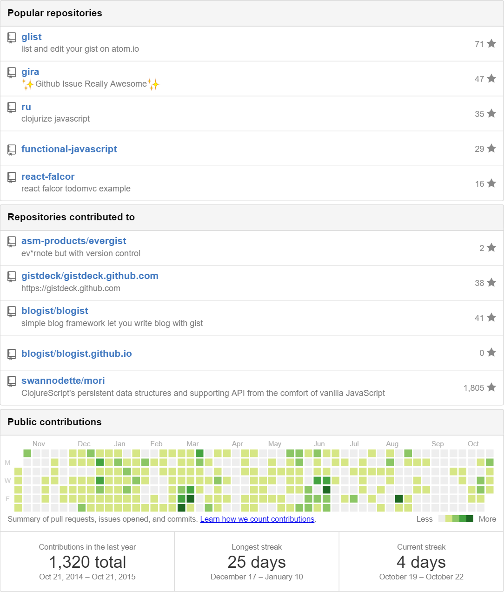

Hi, this is just a little hack to make your self a nice Github Contribution Widget.

place the following code anywhere you want to place this widget

```html
  <div id="github-widget" data-user="your-github-username" data-display="pop_repos,calendar"></div>
  <script src="https://gh-widget.oyanglul.us/index.js"></script>
```
then BOOM! 🎆


## Try
- https://gh-widget.oyanglul.us/<your-github-username>

## Live Example
- http://blog.oyanglul.us/~jichao.ouyang.html

## How this works
- Q:Where is the server?
   - A: backend code is just a gist file https://gist.github.com/jcouyang/aec5210828043d5505bd which just simple scrape your github profile page and provide a nice json file.
and I've create gist.github.com.ru (**ru** is for ruby) as a my little service deployed in heroku, which can run ruby code in gist.github.com. it's quite handy than AWS lambda if you don't care anyone can see your source code.
So it's the only server ever needed.
- Q: How can you handle gh-widget.oyanglul.us without a server.
   - A: github custom 404 page which redirect any path to my 404.html, and that html have a script to handle the path as parameter. for example, https://gh-widget.oyanglul.us/jcouyang will actually toes to 404.html

